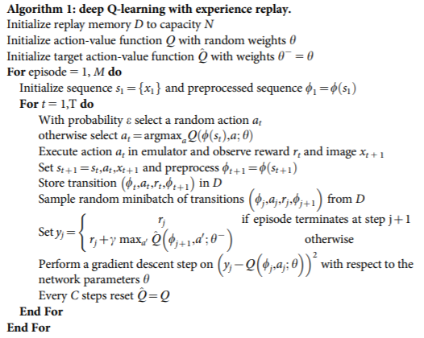
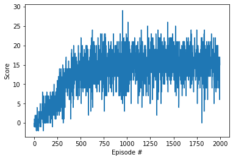

# Report 

 The environment of this project is described in [Readme.md](https://github.com/sunezr/Udacity-DRLND-projects/blob/master/p1_navigation/README.md) file. In this environment, state size is 37 and action size is 4. The solution to the DQN coding exercise is utilised in this project. 

## Learning Algorithm

### DQN Algorithm

The agent is trained with [DQN](https://storage.googleapis.com/deepmind-media/dqn/DQNNaturePaper.pdf) (Deep  Q-Network) algorithm. Deep Q-learning with experience replay mainly contains a neural network to learn Q-Network and a replay buffer to store experiences. When experiences in replay buffer is adequate, sample from it to train Q-network. There are 2 action-value network, target Q and  local Q. While training, the target Q is fixed temporally and local Q is updated, then target Q is updated after certain steps. The environment is solved when the average reward  over the last 100 episodes  is at least +13. 

 

###  Hyper Parameters 

> Neural network 

The deep neural network defined in `model.py` is consist of 3 hidden layers with ReLU activation, `fc1_units=256`, `fc2_unit=64`. 

>  Agent

Agent is defined in `dqn_agent.py`.

* `BUFFER_SIZE = 1e5`         # replay buffer size
* `BATCH_SIZE = 64`             # minibatch size
* `GAMMA = 0.99`            	  # reward discount factor
* `TAU = 1e-3`             		# for soft update of target parameters
* `LR = 5e-4`              		 # learning rate 
* `UPDATE_EVERY = 4`           # how often to update the network

> Train

* `n_episodes = 2000`          # max number of episodes 
* `max_t = 1000`                   # max step in each episode
* `eps_start = 1.0`              # epsilon of greedy-epsilon policy
* `eps_end = 0.01`                # min epsilon
* `eps_decay = 0.995`           # epsilon decay rate

## Plot of Rewards

The result is shown below, and environment is solved in 520 epochs, average score of 100 episodes(421 to 520) is 13.05.

## Ideas for Future Work

> * The neural network can be deeper and dropout can be introduced.
> * The hyperparameters can be fine tuned.
> *  [double DQN](https://arxiv.org/abs/1509.06461) and [dueling DQN](https://arxiv.org/abs/1511.06581) can be implemented.

